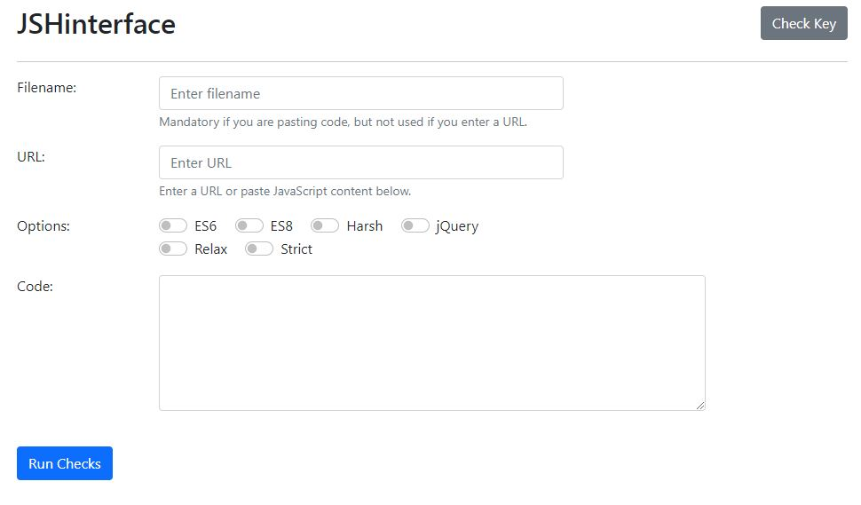

# JSHint-project

This is a small walk-through project on APIs as part of the Code Institute Full Stack Diploma in Software Development.

[Link to deployed project](https://aleksandracodes.github.io/JSHint-project/)

